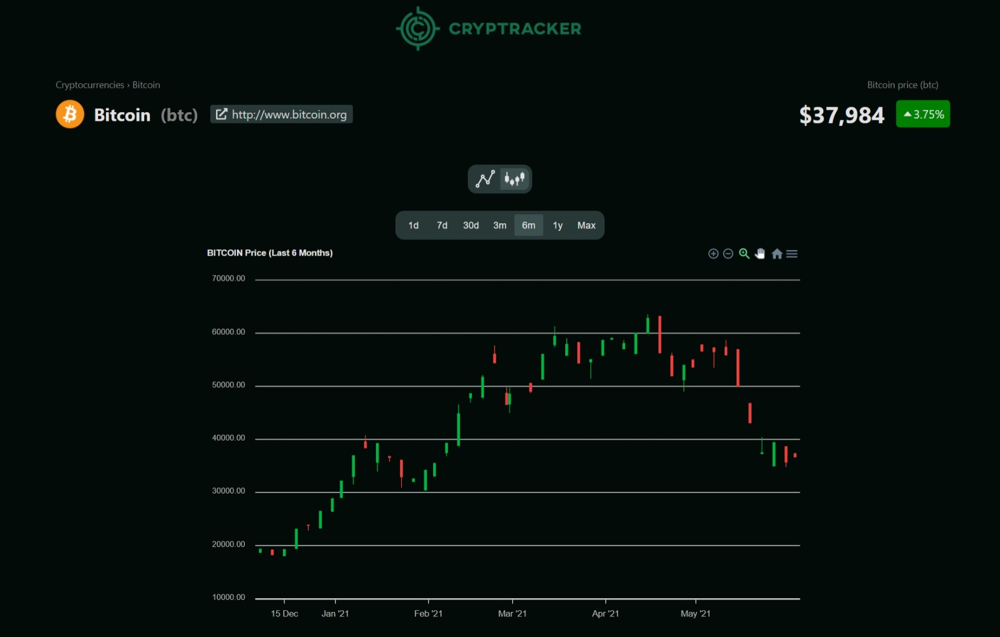

# Cryptracker

           

## Description

A cryptocurrencies price and information tracker web and mobile applications.The web app provides price history data with 2 different types of interactive charts: Line and Candlestick charts.

## Built With

- [React](https://reactjs.org/)
- [React Native](https://reactnative.dev/)
- [CoinGecko API](https://www.coingecko.com/en/api)

## Screenshots

### Web

#### Search

#### Pagination

#### Items per page selection

### Details page and price history charts

#### Line Chart

#### Candlestick Chart

#### Different chart duration selection

### Mobile

